# Function map: TupleKit

One chart per file. Nodes list explicit Swift callable declarations with source lines. Arrows show compiler-resolved references to functions, including calls and function values. Gray nodes are callees declared elsewhere; a shaded node with no project location is not mapped to a declaration in these charts.

---

## ElementwiseTuple.swift

[`Sources/TupleKit/ElementwiseTuple.swift`](../../Sources/TupleKit/ElementwiseTuple.swift)

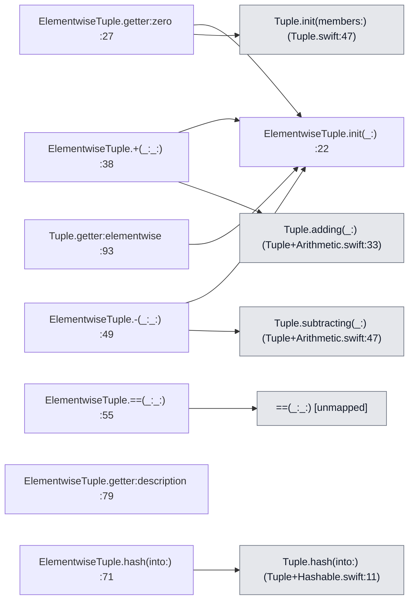
```mermaid
flowchart LR
  n0["ElementwiseTuple.init(_:) :22"]
  n1["ElementwiseTuple.getter:zero :27"]
  n2["ElementwiseTuple.+(_:_:) :38"]
  n3["ElementwiseTuple.-(_:_:) :49"]
  n4["ElementwiseTuple.==(_:_:) :55"]
  n5["ElementwiseTuple.hash(into:) :71"]
  n6["ElementwiseTuple.getter:description :79"]
  n7["Tuple.getter:elementwise :93"]
  n8["Tuple.init(members:) (Tuple.swift:47)"]
  n9["Tuple.adding(_:) (Tuple+Arithmetic.swift:33)"]
  n10["Tuple.subtracting(_:) (Tuple+Arithmetic.swift:47)"]
  n11["==(_:_:) [unmapped]"]
  n12["Tuple.hash(into:) (Tuple+Hashable.swift:11)"]
  n1 --> n0
  n1 --> n8
  n2 --> n0
  n2 --> n9
  n3 --> n0
  n3 --> n10
  n4 --> n11
  n5 --> n12
  n7 --> n0
  classDef elsewhere fill:#e5e7eb,color:#111827,stroke:#6b7280
  class n8,n9,n10,n11,n12 elsewhere
```

---

## Tuple+CustomPlaygroundDisplayConvertible.swift

[`Sources/TupleKit/Extension/CustomProtocols/Tuple+CustomPlaygroundDisplayConvertible.swift`](../../Sources/TupleKit/Extension/CustomProtocols/Tuple+CustomPlaygroundDisplayConvertible.swift)

```mermaid
flowchart LR
  n0["Tuple.getter:playgroundDescription :3"]
```

---

## Tuple+CustomReflectable.swift

[`Sources/TupleKit/Extension/CustomProtocols/Tuple+CustomReflectable.swift`](../../Sources/TupleKit/Extension/CustomProtocols/Tuple+CustomReflectable.swift)

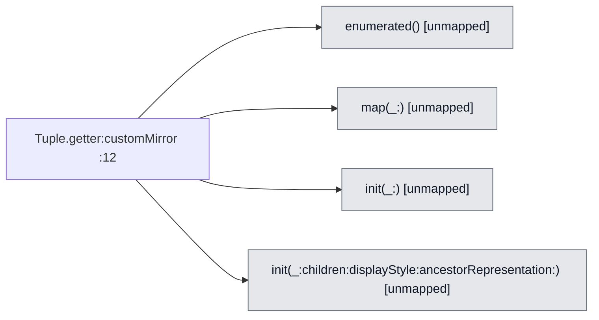
```mermaid
flowchart LR
  n0["Tuple.getter:customMirror :12"]
  n1["enumerated() [unmapped]"]
  n2["map(_:) [unmapped]"]
  n3["init(_:) [unmapped]"]
  n4["init(_:children:displayStyle:ancestorRepresentation:) [unmapped]"]
  n0 --> n1
  n0 --> n2
  n0 --> n3
  n0 --> n4
  classDef elsewhere fill:#e5e7eb,color:#111827,stroke:#6b7280
  class n1,n2,n3,n4 elsewhere
```

---

## Tuple+CustomStringConvertible.swift

[`Sources/TupleKit/Extension/CustomProtocols/Tuple+CustomStringConvertible.swift`](../../Sources/TupleKit/Extension/CustomProtocols/Tuple+CustomStringConvertible.swift)

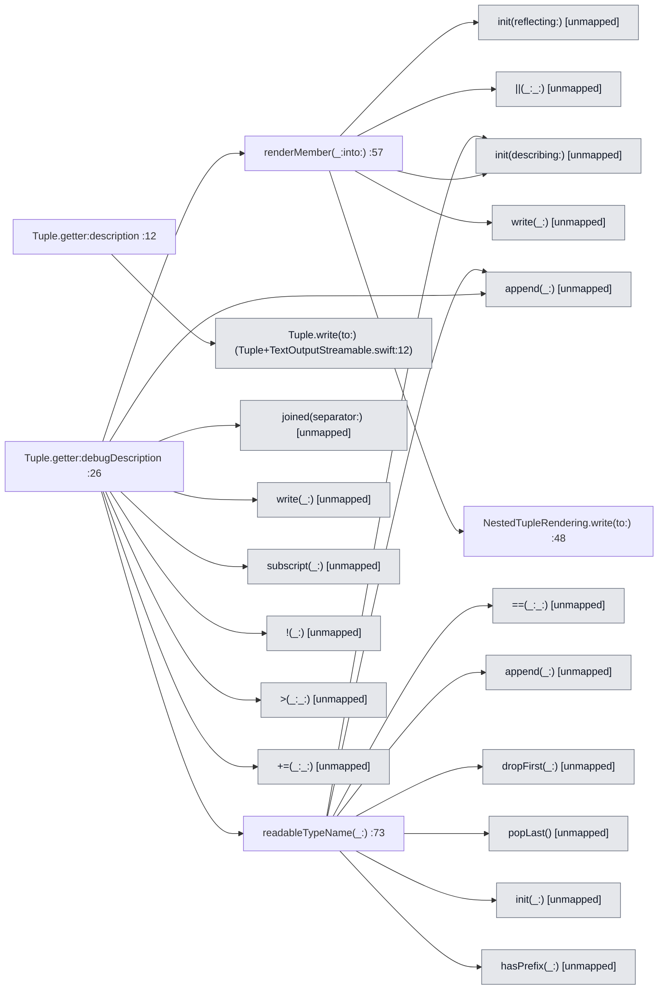
```mermaid
flowchart LR
  n0["Tuple.getter:description :12"]
  n1["Tuple.getter:debugDescription :26"]
  n2["NestedTupleRendering.write(to:) :48"]
  n3["renderMember(_:into:) :57"]
  n4["readableTypeName(_:) :73"]
  n5["Tuple.write(to:) (Tuple+TextOutputStreamable.swift:12)"]
  n6["joined(separator:) [unmapped]"]
  n7["write(_:) [unmapped]"]
  n8["append(_:) [unmapped]"]
  n9["subscript(_:) [unmapped]"]
  n10["!(_:) [unmapped]"]
  n11["#62;(_:_:) [unmapped]"]
  n12["+=(_:_:) [unmapped]"]
  n13["init(describing:) [unmapped]"]
  n14["init(reflecting:) [unmapped]"]
  n15["||(_:_:) [unmapped]"]
  n16["write(_:) [unmapped]"]
  n17["==(_:_:) [unmapped]"]
  n18["append(_:) [unmapped]"]
  n19["dropFirst(_:) [unmapped]"]
  n20["popLast() [unmapped]"]
  n21["init(_:) [unmapped]"]
  n22["hasPrefix(_:) [unmapped]"]
  n0 --> n5
  n1 --> n6
  n1 --> n7
  n1 --> n8
  n1 --> n9
  n1 --> n10
  n1 --> n11
  n1 --> n12
  n1 --> n3
  n1 --> n4
  n3 --> n13
  n3 --> n14
  n3 --> n15
  n3 --> n16
  n3 --> n2
  n4 --> n17
  n4 --> n13
  n4 --> n18
  n4 --> n8
  n4 --> n19
  n4 --> n20
  n4 --> n21
  n4 --> n22
  classDef elsewhere fill:#e5e7eb,color:#111827,stroke:#6b7280
  class n5,n6,n7,n8,n9,n10,n11,n12,n13,n14,n15,n16,n17,n18,n19,n20,n21,n22 elsewhere
```

---

## Tuple+TextOutputStreamable.swift

[`Sources/TupleKit/Extension/CustomProtocols/Tuple+TextOutputStreamable.swift`](../../Sources/TupleKit/Extension/CustomProtocols/Tuple+TextOutputStreamable.swift)

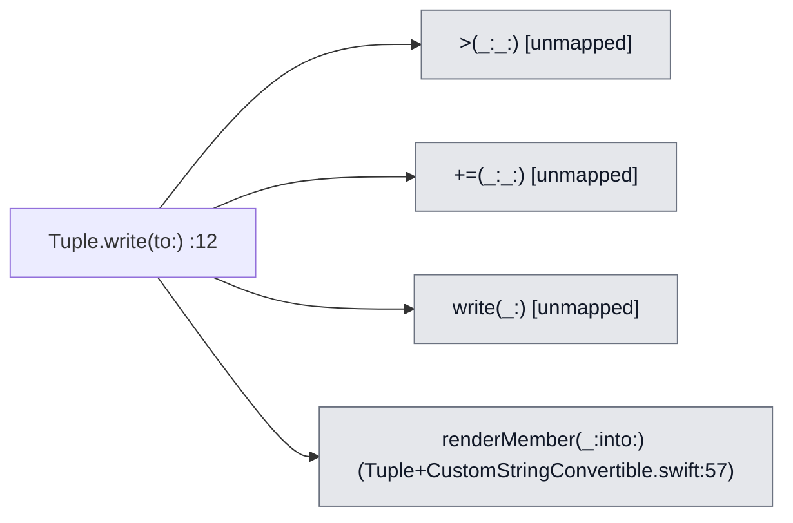
```mermaid
flowchart LR
  n0["Tuple.write(to:) :12"]
  n1["renderMember(_:into:) (Tuple+CustomStringConvertible.swift:57)"]
  n2["#62;(_:_:) [unmapped]"]
  n3["+=(_:_:) [unmapped]"]
  n4["write(_:) [unmapped]"]
  n0 --> n2
  n0 --> n3
  n0 --> n4
  n0 --> n1
  classDef elsewhere fill:#e5e7eb,color:#111827,stroke:#6b7280
  class n1,n2,n3,n4 elsewhere
```

---

## Tuple+Arithmetic.swift

[`Sources/TupleKit/Extension/Tuple+Arithmetic.swift`](../../Sources/TupleKit/Extension/Tuple+Arithmetic.swift)

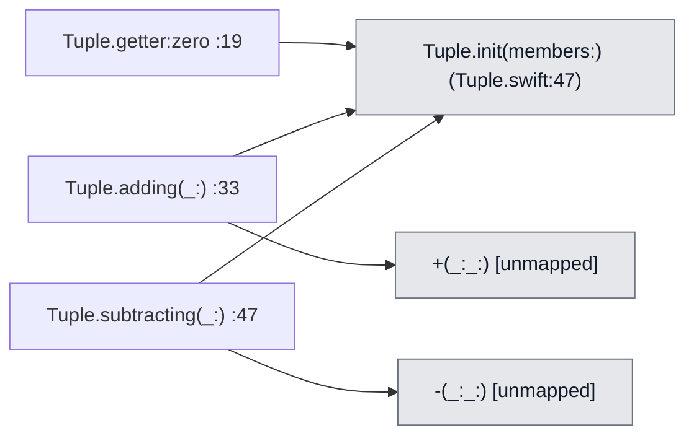
```mermaid
flowchart LR
  n0["Tuple.getter:zero :19"]
  n1["Tuple.adding(_:) :33"]
  n2["Tuple.subtracting(_:) :47"]
  n3["Tuple.init(members:) (Tuple.swift:47)"]
  n4["+(_:_:) [unmapped]"]
  n5["-(_:_:) [unmapped]"]
  n0 --> n3
  n1 --> n4
  n1 --> n3
  n2 --> n5
  n2 --> n3
  classDef elsewhere fill:#e5e7eb,color:#111827,stroke:#6b7280
  class n3,n4,n5 elsewhere
```

---

## Tuple+AsyncMemberWork.swift

[`Sources/TupleKit/Extension/Tuple+AsyncMemberWork.swift`](../../Sources/TupleKit/Extension/Tuple+AsyncMemberWork.swift)

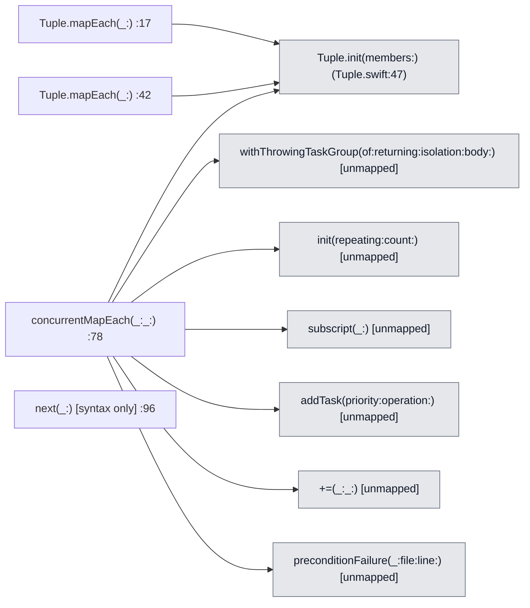
```mermaid
flowchart LR
  n0["Tuple.mapEach(_:) :17"]
  n1["Tuple.mapEach(_:) :42"]
  n2["concurrentMapEach(_:_:) :78"]
  n3["next(_:) [syntax only] :96"]
  n4["Tuple.init(members:) (Tuple.swift:47)"]
  n5["withThrowingTaskGroup(of:returning:isolation:body:) [unmapped]"]
  n6["init(repeating:count:) [unmapped]"]
  n7["subscript(_:) [unmapped]"]
  n8["addTask(priority:operation:) [unmapped]"]
  n9["+=(_:_:) [unmapped]"]
  n10["preconditionFailure(_:file:line:) [unmapped]"]
  n0 --> n4
  n1 --> n4
  n2 --> n5
  n2 --> n6
  n2 --> n7
  n2 --> n8
  n2 --> n9
  n2 --> n10
  n2 --> n4
  classDef elsewhere fill:#e5e7eb,color:#111827,stroke:#6b7280
  class n4,n5,n6,n7,n8,n9,n10 elsewhere
```

---

## Tuple+BitwiseCopyable.swift

[`Sources/TupleKit/Extension/Tuple+BitwiseCopyable.swift`](../../Sources/TupleKit/Extension/Tuple+BitwiseCopyable.swift)

No explicit callable declarations or named function references indexed.

---

## Tuple+CaseIterable.swift

[`Sources/TupleKit/Extension/Tuple+CaseIterable.swift`](../../Sources/TupleKit/Extension/Tuple+CaseIterable.swift)

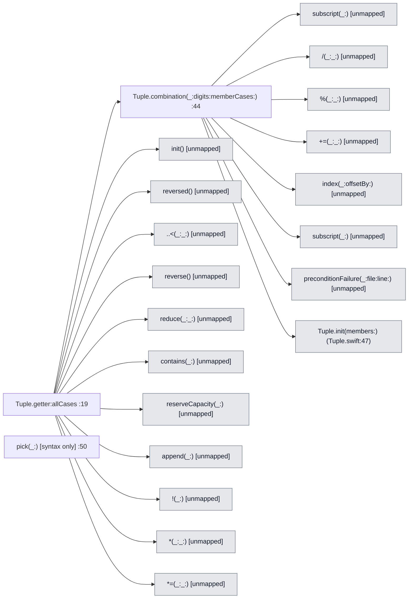
```mermaid
flowchart LR
  n0["Tuple.getter:allCases :19"]
  n1["Tuple.combination(_:digits:memberCases:) :44"]
  n2["pick(_:) [syntax only] :50"]
  n3["init() [unmapped]"]
  n4["reversed() [unmapped]"]
  n5["..#60;(_:_:) [unmapped]"]
  n6["reverse() [unmapped]"]
  n7["reduce(_:_:) [unmapped]"]
  n8["contains(_:) [unmapped]"]
  n9["reserveCapacity(_:) [unmapped]"]
  n10["append(_:) [unmapped]"]
  n11["!(_:) [unmapped]"]
  n12["*(_:_:) [unmapped]"]
  n13["*=(_:_:) [unmapped]"]
  n14["Tuple.init(members:) (Tuple.swift:47)"]
  n15["subscript(_:) [unmapped]"]
  n16["/(_:_:) [unmapped]"]
  n17["%(_:_:) [unmapped]"]
  n18["+=(_:_:) [unmapped]"]
  n19["index(_:offsetBy:) [unmapped]"]
  n20["subscript(_:) [unmapped]"]
  n21["preconditionFailure(_:file:line:) [unmapped]"]
  n0 --> n3
  n0 --> n4
  n0 --> n5
  n0 --> n6
  n0 --> n7
  n0 --> n8
  n0 --> n9
  n0 --> n10
  n0 --> n11
  n0 --> n12
  n0 --> n13
  n0 --> n1
  n1 --> n15
  n1 --> n16
  n1 --> n17
  n1 --> n18
  n1 --> n19
  n1 --> n20
  n1 --> n21
  n1 --> n14
  classDef elsewhere fill:#e5e7eb,color:#111827,stroke:#6b7280
  class n3,n4,n5,n6,n7,n8,n9,n10,n11,n12,n13,n14,n15,n16,n17,n18,n19,n20,n21 elsewhere
```

---

## Tuple+Codable.swift

[`Sources/TupleKit/Extension/Tuple+Codable.swift`](../../Sources/TupleKit/Extension/Tuple+Codable.swift)

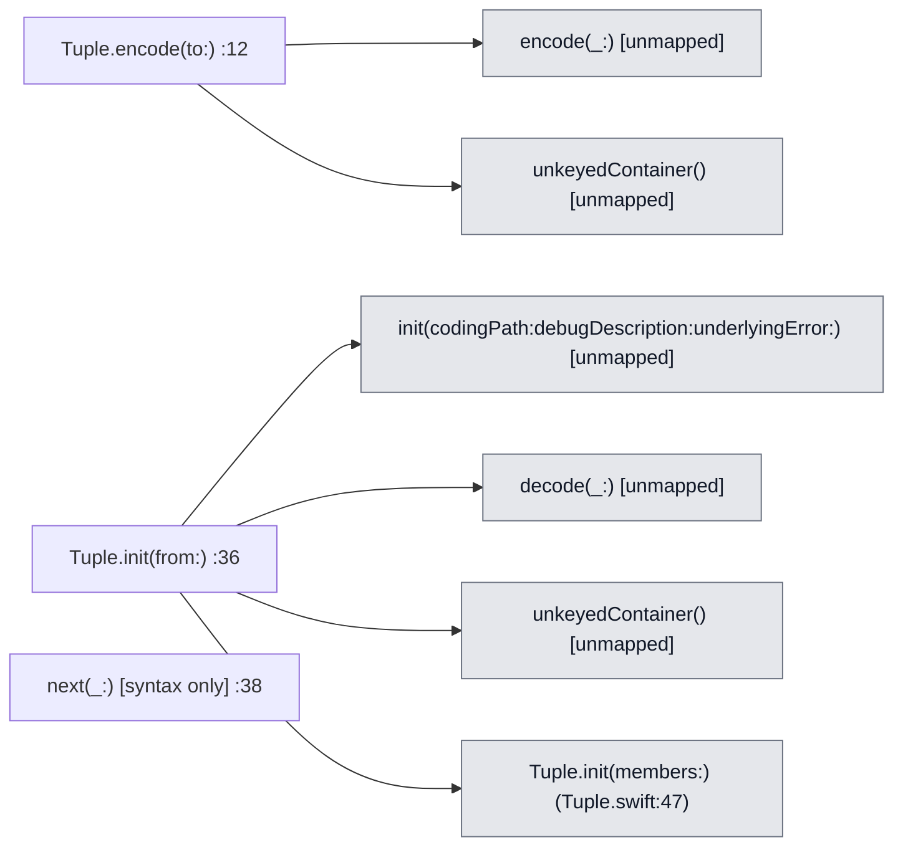
```mermaid
flowchart LR
  n0["Tuple.encode(to:) :12"]
  n1["Tuple.init(from:) :36"]
  n2["next(_:) [syntax only] :38"]
  n3["encode(_:) [unmapped]"]
  n4["unkeyedContainer() [unmapped]"]
  n5["Tuple.init(members:) (Tuple.swift:47)"]
  n6["init(codingPath:debugDescription:underlyingError:) [unmapped]"]
  n7["decode(_:) [unmapped]"]
  n8["unkeyedContainer() [unmapped]"]
  n0 --> n3
  n0 --> n4
  n1 --> n6
  n1 --> n7
  n1 --> n8
  n1 --> n5
  classDef elsewhere fill:#e5e7eb,color:#111827,stroke:#6b7280
  class n3,n4,n5,n6,n7,n8 elsewhere
```

---

## Tuple+Combining.swift

[`Sources/TupleKit/Extension/Tuple+Combining.swift`](../../Sources/TupleKit/Extension/Tuple+Combining.swift)

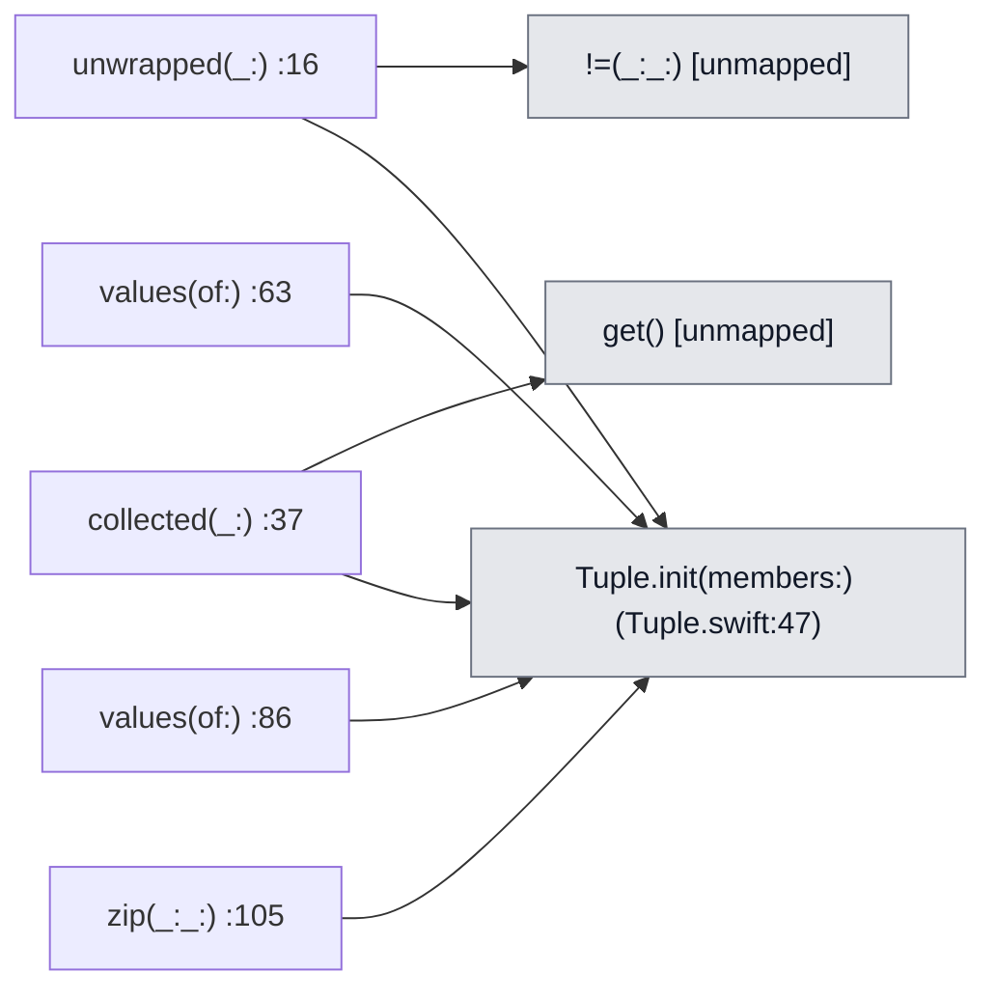
```mermaid
flowchart LR
  n0["unwrapped(_:) :16"]
  n1["collected(_:) :37"]
  n2["values(of:) :63"]
  n3["values(of:) :86"]
  n4["zip(_:_:) :105"]
  n5["Tuple.init(members:) (Tuple.swift:47)"]
  n6["!=(_:_:) [unmapped]"]
  n7["get() [unmapped]"]
  n0 --> n6
  n0 --> n5
  n1 --> n7
  n1 --> n5
  n2 --> n5
  n3 --> n5
  n4 --> n5
  classDef elsewhere fill:#e5e7eb,color:#111827,stroke:#6b7280
  class n5,n6,n7 elsewhere
```

---

## Tuple+Comparable.swift

[`Sources/TupleKit/Extension/Tuple+Comparable.swift`](../../Sources/TupleKit/Extension/Tuple+Comparable.swift)

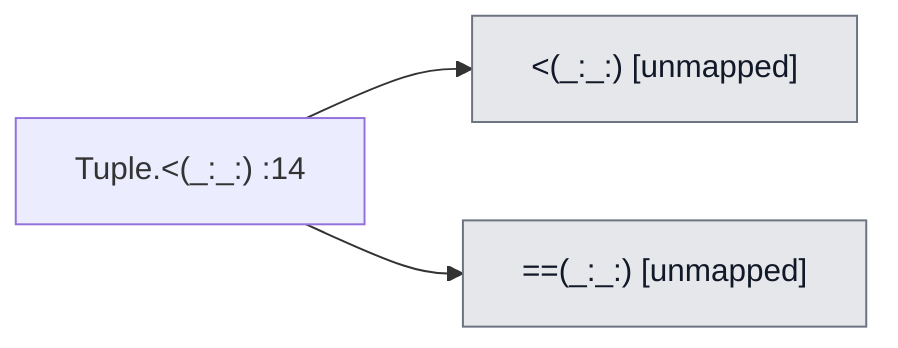
```mermaid
flowchart LR
  n0["Tuple.#60;(_:_:) :14"]
  n1["#60;(_:_:) [unmapped]"]
  n2["==(_:_:) [unmapped]"]
  n0 --> n1
  n0 --> n2
  classDef elsewhere fill:#e5e7eb,color:#111827,stroke:#6b7280
  class n1,n2 elsewhere
```

---

## Tuple+Concatenation.swift

[`Sources/TupleKit/Extension/Tuple+Concatenation.swift`](../../Sources/TupleKit/Extension/Tuple+Concatenation.swift)

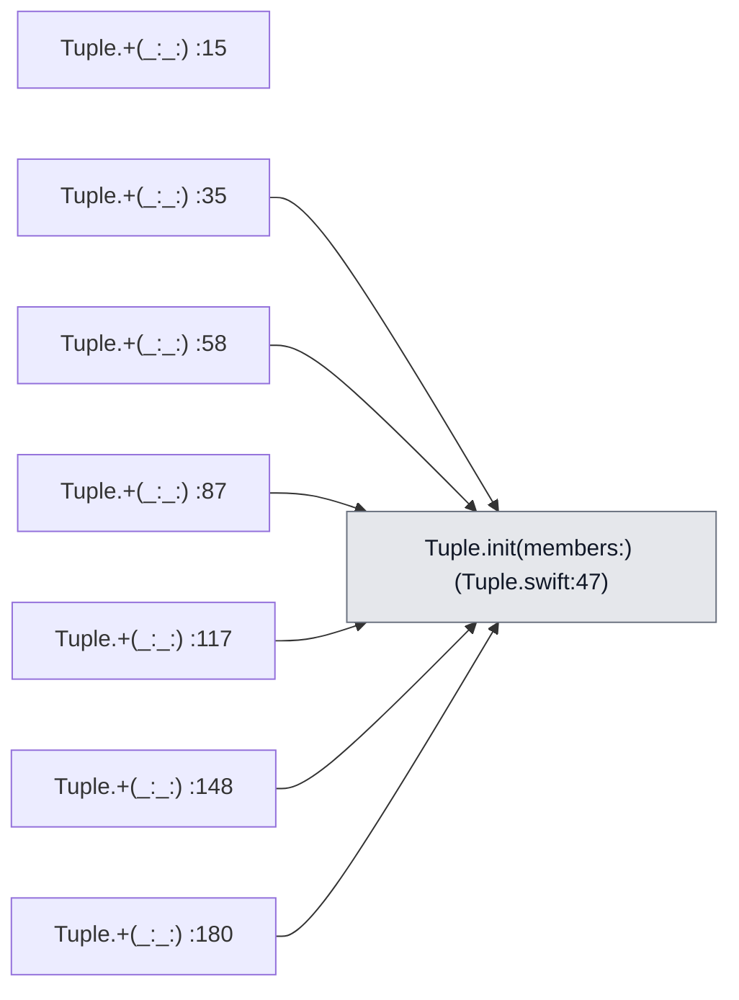
```mermaid
flowchart LR
  n0["Tuple.+(_:_:) :15"]
  n1["Tuple.+(_:_:) :35"]
  n2["Tuple.+(_:_:) :58"]
  n3["Tuple.+(_:_:) :87"]
  n4["Tuple.+(_:_:) :117"]
  n5["Tuple.+(_:_:) :148"]
  n6["Tuple.+(_:_:) :180"]
  n7["Tuple.init(members:) (Tuple.swift:47)"]
  n1 --> n7
  n2 --> n7
  n3 --> n7
  n4 --> n7
  n5 --> n7
  n6 --> n7
  classDef elsewhere fill:#e5e7eb,color:#111827,stroke:#6b7280
  class n7 elsewhere
```

---

## Tuple+Equatable.swift

[`Sources/TupleKit/Extension/Tuple+Equatable.swift`](../../Sources/TupleKit/Extension/Tuple+Equatable.swift)

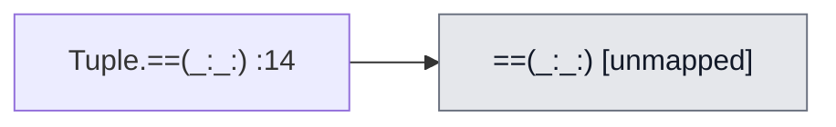
```mermaid
flowchart LR
  n0["Tuple.==(_:_:) :14"]
  n1["==(_:_:) [unmapped]"]
  n0 --> n1
  classDef elsewhere fill:#e5e7eb,color:#111827,stroke:#6b7280
  class n1 elsewhere
```

---

## Tuple+Hashable.swift

[`Sources/TupleKit/Extension/Tuple+Hashable.swift`](../../Sources/TupleKit/Extension/Tuple+Hashable.swift)

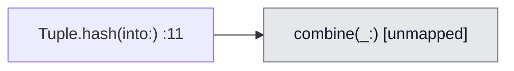
```mermaid
flowchart LR
  n0["Tuple.hash(into:) :11"]
  n1["combine(_:) [unmapped]"]
  n0 --> n1
  classDef elsewhere fill:#e5e7eb,color:#111827,stroke:#6b7280
  class n1 elsewhere
```

---

## Tuple+MappingSubscript.swift

[`Sources/TupleKit/Extension/Tuple+MappingSubscript.swift`](../../Sources/TupleKit/Extension/Tuple+MappingSubscript.swift)

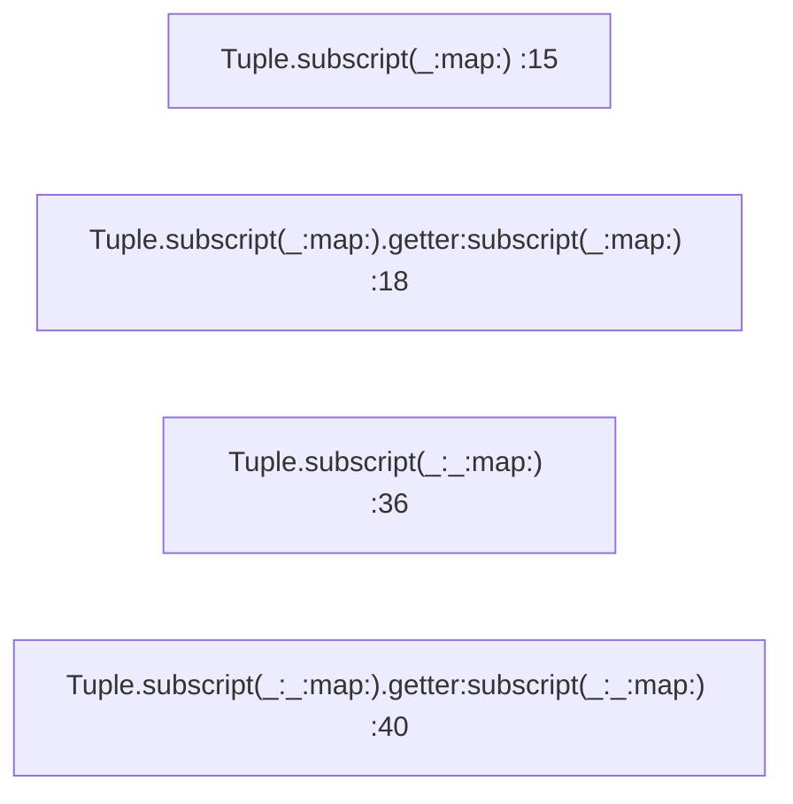
```mermaid
flowchart LR
  n0["Tuple.subscript(_:map:) :15"]
  n1["Tuple.subscript(_:map:).getter:subscript(_:map:) :18"]
  n2["Tuple.subscript(_:_:map:) :36"]
  n3["Tuple.subscript(_:_:map:).getter:subscript(_:_:map:) :40"]
```

---

## Tuple+RawRepresentable.swift

[`Sources/TupleKit/Extension/Tuple+RawRepresentable.swift`](../../Sources/TupleKit/Extension/Tuple+RawRepresentable.swift)

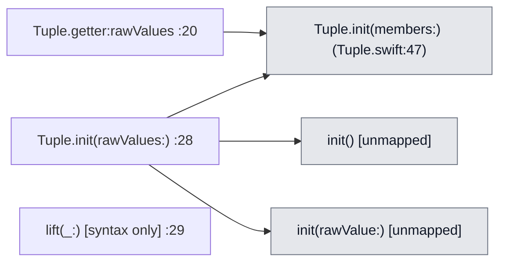
```mermaid
flowchart LR
  n0["Tuple.getter:rawValues :20"]
  n1["Tuple.init(rawValues:) :28"]
  n2["lift(_:) [syntax only] :29"]
  n3["Tuple.init(members:) (Tuple.swift:47)"]
  n4["init() [unmapped]"]
  n5["init(rawValue:) [unmapped]"]
  n0 --> n3
  n1 --> n4
  n1 --> n5
  n1 --> n3
  classDef elsewhere fill:#e5e7eb,color:#111827,stroke:#6b7280
  class n3,n4,n5 elsewhere
```

---

## Tuple+TypedAccess.swift

[`Sources/TupleKit/Extension/Tuple+TypedAccess.swift`](../../Sources/TupleKit/Extension/Tuple+TypedAccess.swift)

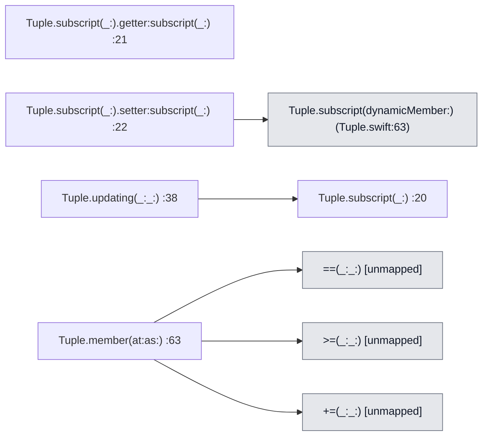
```mermaid
flowchart LR
  n0["Tuple.subscript(_:) :20"]
  n1["Tuple.subscript(_:).getter:subscript(_:) :21"]
  n2["Tuple.subscript(_:).setter:subscript(_:) :22"]
  n3["Tuple.updating(_:_:) :38"]
  n4["Tuple.member(at:as:) :63"]
  n5["Tuple.subscript(dynamicMember:) (Tuple.swift:63)"]
  n6["==(_:_:) [unmapped]"]
  n7["#62;=(_:_:) [unmapped]"]
  n8["+=(_:_:) [unmapped]"]
  n2 --> n5
  n3 --> n0
  n4 --> n6
  n4 --> n7
  n4 --> n8
  classDef elsewhere fill:#e5e7eb,color:#111827,stroke:#6b7280
  class n5,n6,n7,n8 elsewhere
```

---

## Tuple.swift

[`Sources/TupleKit/Tuple.swift`](../../Sources/TupleKit/Tuple.swift)

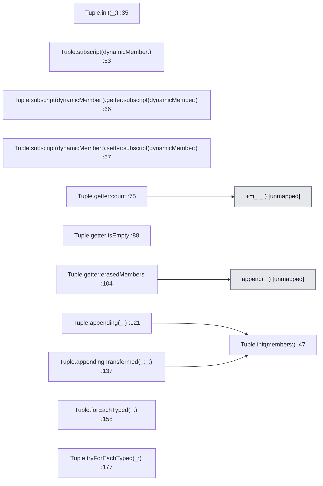
```mermaid
flowchart LR
  n0["Tuple.init(_:) :35"]
  n1["Tuple.init(members:) :47"]
  n2["Tuple.subscript(dynamicMember:) :63"]
  n3["Tuple.subscript(dynamicMember:).getter:subscript(dynamicMember:) :66"]
  n4["Tuple.subscript(dynamicMember:).setter:subscript(dynamicMember:) :67"]
  n5["Tuple.getter:count :75"]
  n6["Tuple.getter:isEmpty :88"]
  n7["Tuple.getter:erasedMembers :104"]
  n8["Tuple.appending(_:) :121"]
  n9["Tuple.appendingTransformed(_:_:) :137"]
  n10["Tuple.forEachTyped(_:) :158"]
  n11["Tuple.tryForEachTyped(_:) :177"]
  n12["+=(_:_:) [unmapped]"]
  n13["append(_:) [unmapped]"]
  n5 --> n12
  n7 --> n13
  n8 --> n1
  n9 --> n1
  classDef elsewhere fill:#e5e7eb,color:#111827,stroke:#6b7280
  class n12,n13 elsewhere
```

---

## TuplePattern.swift

[`Sources/TupleKit/TuplePattern.swift`](../../Sources/TupleKit/TuplePattern.swift)

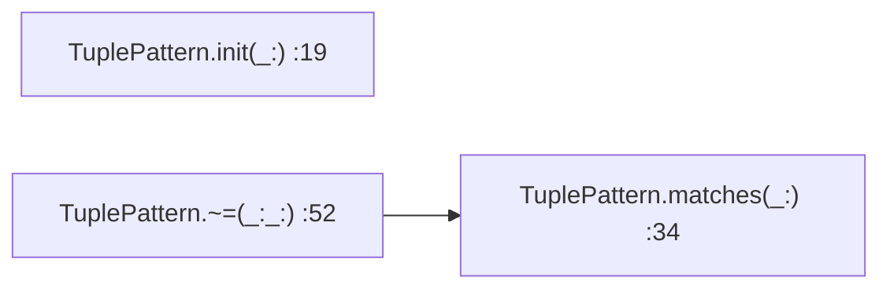
```mermaid
flowchart LR
  n0["TuplePattern.init(_:) :19"]
  n1["TuplePattern.matches(_:) :34"]
  n2["TuplePattern.~=(_:_:) :52"]
  n2 --> n1
```

---

## TupleZipSequence.swift

[`Sources/TupleKit/TupleZipSequence.swift`](../../Sources/TupleKit/TupleZipSequence.swift)

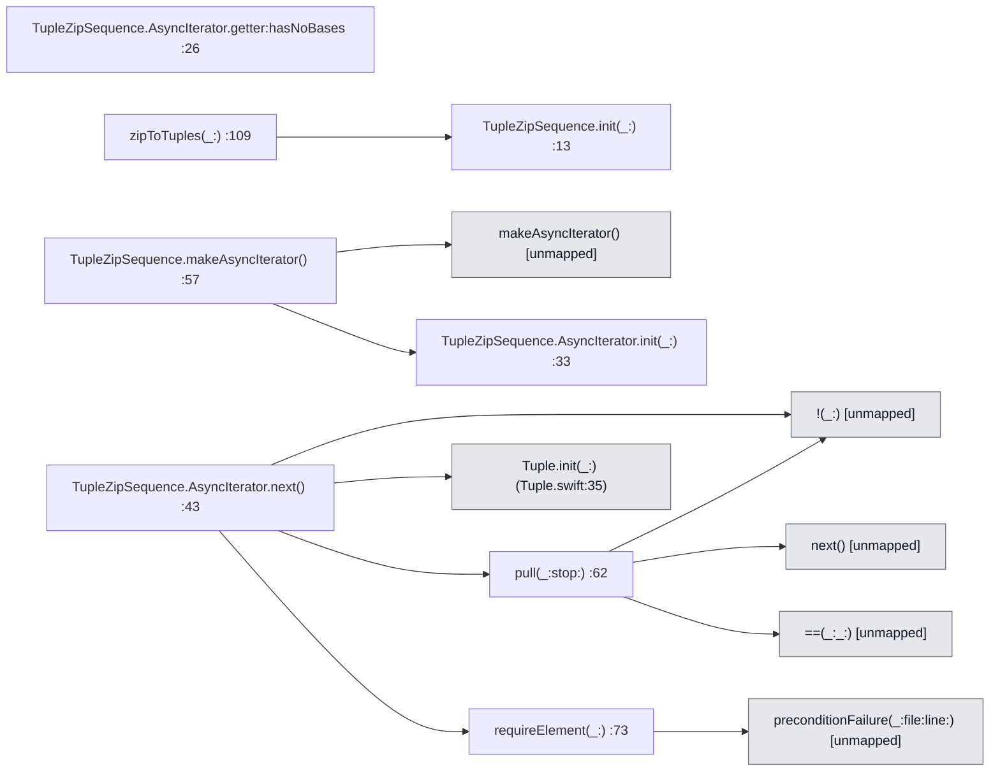
```mermaid
flowchart LR
  n0["TupleZipSequence.init(_:) :13"]
  n1["TupleZipSequence.AsyncIterator.getter:hasNoBases :26"]
  n2["TupleZipSequence.AsyncIterator.init(_:) :33"]
  n3["TupleZipSequence.AsyncIterator.next() :43"]
  n4["TupleZipSequence.makeAsyncIterator() :57"]
  n5["pull(_:stop:) :62"]
  n6["requireElement(_:) :73"]
  n7["zipToTuples(_:) :109"]
  n8["Tuple.init(_:) (Tuple.swift:35)"]
  n9["!(_:) [unmapped]"]
  n10["makeAsyncIterator() [unmapped]"]
  n11["next() [unmapped]"]
  n12["==(_:_:) [unmapped]"]
  n13["preconditionFailure(_:file:line:) [unmapped]"]
  n3 --> n9
  n3 --> n8
  n3 --> n5
  n3 --> n6
  n4 --> n10
  n4 --> n2
  n5 --> n9
  n5 --> n11
  n5 --> n12
  n6 --> n13
  n7 --> n0
  classDef elsewhere fill:#e5e7eb,color:#111827,stroke:#6b7280
  class n8,n9,n10,n11,n12,n13 elsewhere
```
